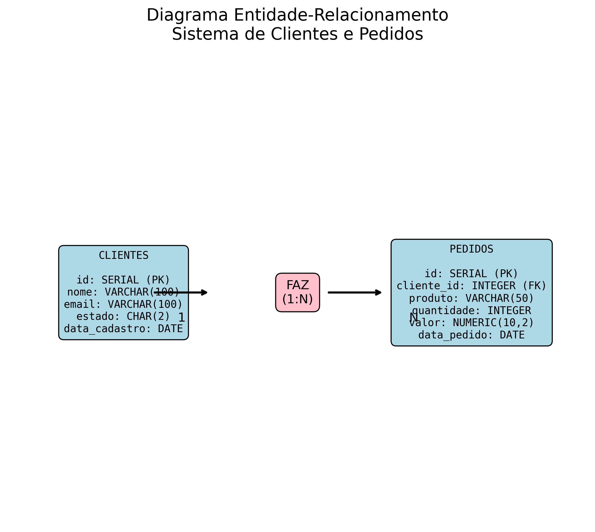

# 🧠 Agente de IA para Consultas em Banco de Dados

Este projeto implementa um agente de IA que converte perguntas em linguagem natural em consultas SQL e executa-as em um banco de dados PostgreSQL.

## ✨ Funcionalidades

- Interpreta perguntas em português natural
- Converte para consultas SQL otimizadas
- Consulta banco de dados PostgreSQL
- Responde com resultados formatados
- Suporte a:
  - Consultas básicas (SELECT)
  - Agregações (COUNT, SUM, AVG)
  - Filtros por data, localização e nomes
  - Ordenação de resultados

## 📋 Pré-requisitos

- Python 3.8+
- PostgreSQL 14+
- spaCy com modelo de português

## 🚀 Instalação

```bash
# Clone o repositório
git clone https://github.com/seu-usuario/ai_agent.git
cd ai_agent

# Crie e ative o ambiente virtual
python -m venv venv
source venv/bin/activate  # Linux/Mac
venv\Scripts\activate    # Windows

# Instale as dependências
pip install -r requirements.txt

# Baixe o modelo de linguagem
python -m spacy download pt_core_news_sm
```

## ⚙️ Configuração do Banco de Dados

1. Crie o banco de dados:
```bash
psql -U postgres -f scripts/setup_database.sql
```

2. Configure o arquivo `.env`:
```bash
cp .env.example .env
nano .env
```

Exemplo de `.env`:
```ini
DB_HOST=localhost
DB_PORT=5432
DB_NAME=empresa_db
DB_USER=postgres
DB_PASSWORD=sua_senha_segura
MAX_RESULTS=100
```

## 🏃 Execução

```bash
python src/agent.py
```

## 💬 Exemplos de Perguntas

- "Mostre os 3 pedidos mais recentes"
- "Quantos clientes temos em São Paulo?"
- "Liste os pedidos da Maria Santos"
- "Qual o valor total de vendas?"
- "Mostre os pedidos de 2023"

## 🧩 Estrutura do Código

```
/src
├── agent.py          # Classe principal do agente
├── nlp_processor.py  # Processamento de linguagem natural
└── database.py       # Conexão com banco de dados

/scripts
└── setup_database.sql  # Script de inicialização do banco
```

## 📊 Diagrama de Entidade-Relacionamento



### Entidades:
- **CLIENTES**: Armazena informações dos clientes
- **PEDIDOS**: Registra os pedidos realizados

### Relacionamento:
- Um cliente pode fazer **N** pedidos (relação 1:N)

## 🤝 Contribuição

Contribuições são bem-vindas! Siga os passos:

1. Faça um fork do projeto
2. Crie uma branch com sua feature (`git checkout -b feature/nova-feature`)
3. Commit suas mudanças (`git commit -m 'Adiciona nova feature'`)
4. Push para a branch (`git push origin feature/nova-feature`)
5. Abra um Pull Request

## 📄 Licença

Este projeto está licenciado sob a licença MIT - veja o arquivo [LICENSE](LICENSE) para detalhes.